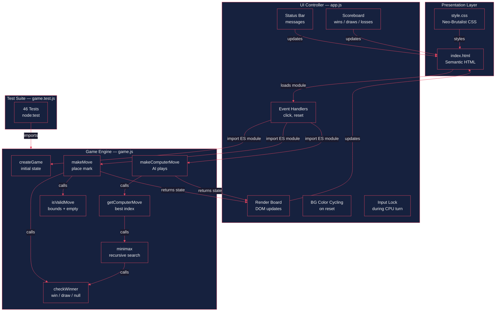
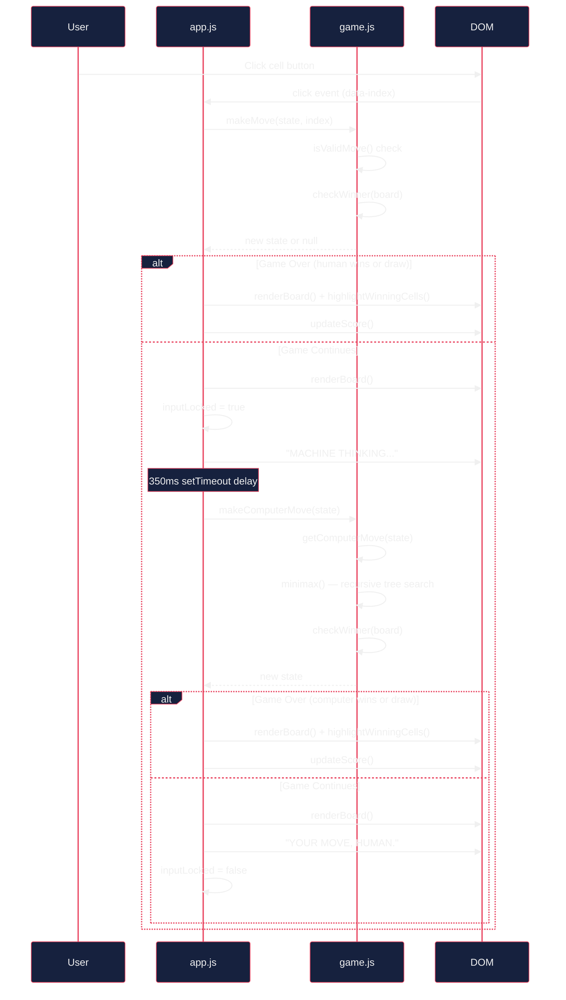
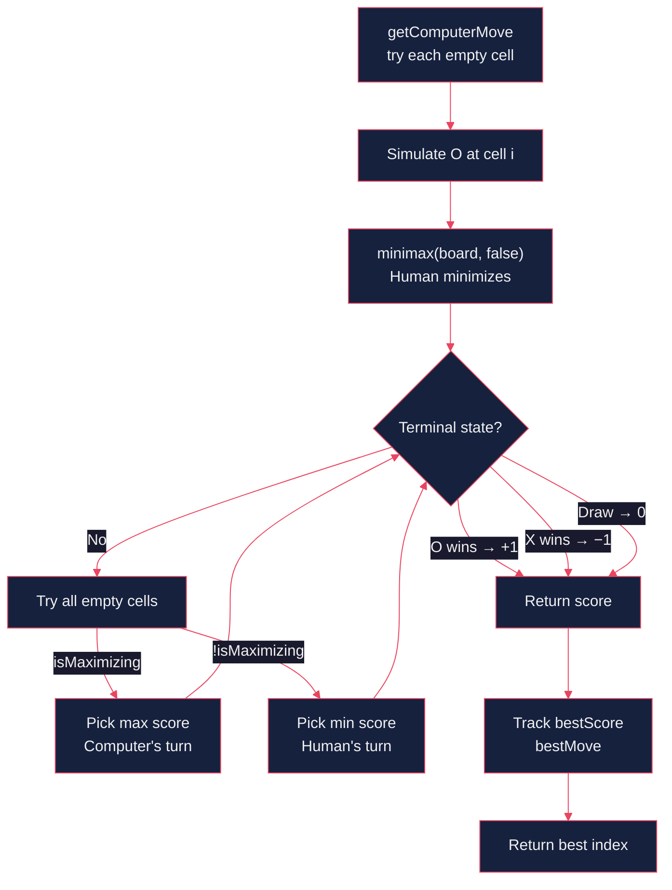

# Architecture — TED TAC TOE: BRUTAL EDITION

## Overview

A single-page, human-versus-computer tic-tac-toe game built with **vanilla JavaScript, HTML, and CSS**. The computer opponent uses a **minimax algorithm** that plays perfectly — it never loses. The UI follows a **neo-brutalist design system**: thick black borders, hard-offset shadows, bold typography, zero border-radius, and a cycling electric-color background.

The codebase enforces a strict separation between **pure game logic** (`game.js`) and **DOM/UI control** (`app.js`), connected through ES module imports.

---

## Architecture Diagram

---

## Game Turn Flow

---

## Minimax AI Flow

---

## Component Descriptions

### `game.js` — Pure Game Engine
The stateless logic core. Every function is pure: no DOM access, no side effects, no global mutation. Exports six functions and three constants via ES modules.

| Export | Purpose |
|---|---|
| `createGame()` | Returns a fresh state: `{ board, currentPlayer, gameOver, winner }` |
| `makeMove(state, index)` | Places the current player's mark. Returns new state or `null` if invalid. |
| `makeComputerMove(state)` | Runs the AI and returns a new state with O placed optimally. |
| `getComputerMove(state)` | Returns just the best cell index (0–8) — separated for UI animation flexibility. |
| `checkWinner(board)` | Scans all 8 win-lines. Returns `'X'`, `'O'`, `'draw'`, or `null`. |
| `isValidMove(state, index)` | Bounds check + empty cell + game not over. |
| `HUMAN / COMPUTER / EMPTY` | Constants: `'X'`, `'O'`, `''`. |

The private `minimax()` function recursively evaluates every possible game tree. Computer maximizes (+1 for O win), Human minimizes (−1 for X win), draws score 0. The AI is provably unbeatable.

### `app.js` — UI Controller
The bridge between DOM and engine. Imports from `game.js` via ES modules. Responsibilities:

- **Event handling** — cell clicks trigger `makeMove`, reset button triggers `createGame` + background color cycle
- **Rendering** — `renderBoard()` syncs `gameState.board` to button text/classes
- **Input locking** — disables clicks during the 350ms computer "thinking" delay
- **Status messages** — "YOUR MOVE, HUMAN.", "MACHINE THINKING...", "YOU WIN!", "MACHINE WINS.", "DRAW. STALEMATE."
- **Score tracking** — persistent wins/draws/losses counters with bump animation
- **Background cycling** — rotates through 12 vivid colors on each new game

### `index.html` — Semantic Markup
Minimal, accessible HTML5 structure:

- `<main>` container with header, status bar, board, controls, scoreboard
- 3×3 grid of `<button class="cell">` elements with `data-index` attributes and ARIA labels
- `aria-live="polite"` on status bar for screen reader announcements
- Single `<script type="module">` loads `app.js`

### `style.css` — Neo-Brutalist Design System
CSS custom properties drive the entire visual identity:

- **Colors** — cycling background (`--color-bg`), X blue (`#1A1AFF`), O pink (`#FF2D55`), win green (`#00FF88`)
- **Borders** — 4–6px solid black, zero border-radius everywhere
- **Shadows** — hard offset `8px 8px 0 #000`, no blur
- **Typography** — Arial Black / Impact for display, Courier New / Consolas for marks
- **Animations** — `popIn` for mark placement, `winPulse` for winning cells, `bump` for score updates
- **Responsive** — `clamp()` for fluid text, `@media (max-width: 400px)` reduces borders/shadows

### `game.test.js` — Test Suite
46 tests using Node.js built-in `node:test` runner with `node:assert/strict`:

| Group | Count | Coverage |
|---|---|---|
| Constants | 3 | HUMAN, COMPUTER, EMPTY values |
| createGame | 2 | Initial state, object identity |
| makeMove | 6 | Valid moves, invalid indices, occupied cells, game-over guard, win/draw detection |
| checkWinner | 11 | All 8 win-lines (rows, columns, diagonals), both players, draw, ongoing |
| isValidMove | 6 | Bounds, occupied, game-over, non-integer |
| getComputerMove | 5 | Win preference, blocking, only-cell, valid index |
| makeComputerMove | 4 | Mark placement, player switch, win detection, state shape |
| Immutability | 2 | makeMove + makeComputerMove don't mutate input |
| Edge cases | 2 | Single empty cell, multiple win-lines |
| AI exhaustive | 1 | Plays all possible human move trees — AI never loses |

Run with: `node --test game.test.js`

---

## Tech Stack

| Layer | Technology |
|---|---|
| Language | Vanilla JavaScript (ES2020+) |
| Modules | ES Modules (`import` / `export`) |
| Markup | Semantic HTML5 |
| Styling | CSS3 with custom properties, Grid, `clamp()`, keyframe animations |
| Testing | `node:test` + `node:assert/strict` (Node.js built-in, zero dependencies) |
| Build | None — no bundler, no transpiler, served as-is |
| Dependencies | Zero |

---

## Design System — Neo-Brutalist

| Principle | Implementation |
|---|---|
| **Thick borders** | 4–6px solid black on all interactive elements |
| **Hard shadows** | `8px 8px 0 #000` — offset with zero blur |
| **No rounding** | `border-radius: 0` enforced everywhere |
| **Bold typography** | Arial Black / Impact display, monospace marks |
| **Raw color** | Electric background cycling (12 colors), saturated mark colors |
| **Honest interaction** | Buttons press into shadows, marks pop in, wins pulse |
| **Responsive brutalism** | Shadows and borders scale down at `≤400px`, fluid `clamp()` type |
