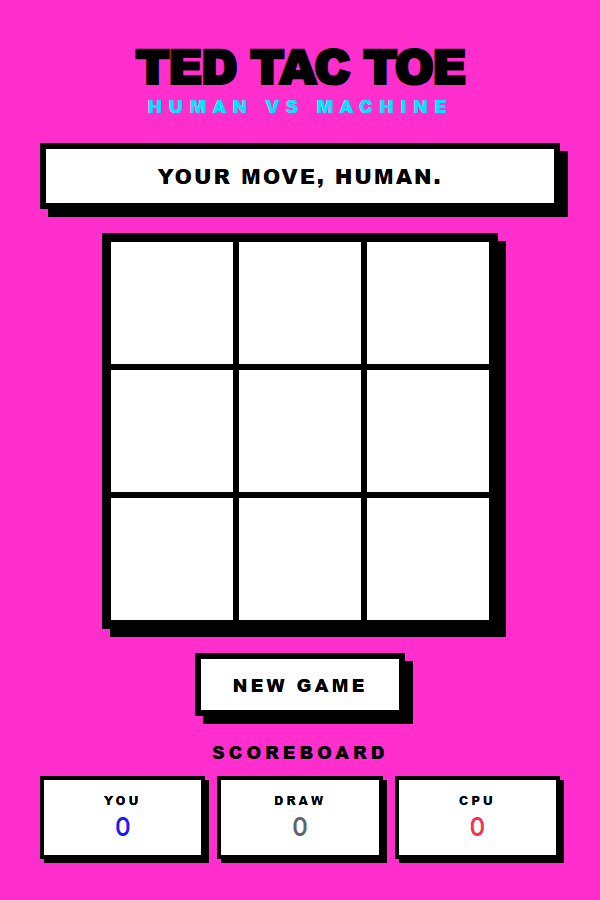

# TedTacToe

**A neo-brutalist tic-tac-toe game.**



## For Ted

Ted Neward once said his litmus test for any tool is: *"Can it build me a working tic-tac-toe game?"*

Challenge accepted.

This game is dedicated to Ted — the person who set the bar, taught us to think critically, and never let us get away with hand-waving. Brady built this one for you, Ted. He hopes you enjoy playing it as much as he's enjoyed everything you've taught him over the years.

You're awesome, Ted. Thanks for raising the bar.

## About

Human vs. Machine tic-tac-toe with an unbeatable AI powered by the minimax algorithm. The computer never loses — but draws are possible if you play perfectly.

- **Neo-brutalist design** — thick borders, hard shadows, bold typography, cycling electric background colors
- **Zero dependencies** — vanilla HTML, CSS, and JavaScript
- **Clean architecture** — pure stateless game engine (`game.js`) separated from DOM controller (`app.js`)

## How to Play

1. Open `index.html` in a browser (or serve it locally)
2. Click a cell to place your **X**
3. The machine responds with **O** *(it's thinking...)*
4. Try to beat it (spoiler: you can't — but draws are possible)
5. Click **NEW GAME** for a fresh round and a new background color

## Tech Stack

- Vanilla JavaScript (ES2020+, ES Modules)
- Semantic HTML5
- CSS3 with custom properties, Grid, and animations
- Zero dependencies, no build step
- Node.js built-in test runner for unit tests

## Running Tests

```
node --test game.test.js
```

46 tests covering game logic, AI behavior, and state immutability. Includes an exhaustive test that plays every possible human move sequence to prove the AI never loses.

## Credits

- **Ted Neward** — for the inspiration and the litmus test
- Built with ❤️ by [Brady](https://github.com/bradygaster)
